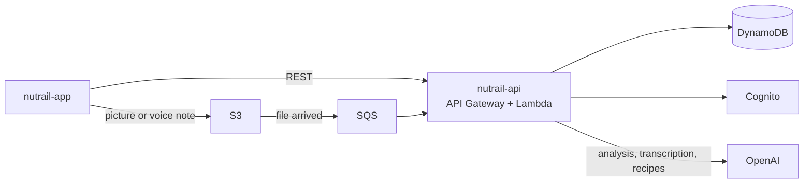
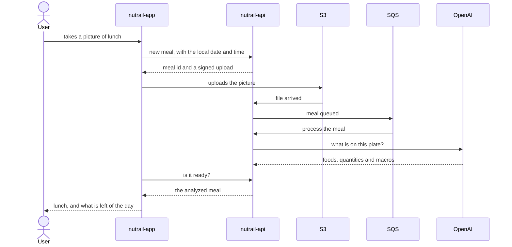

# Nutrail

An AI-first food diary: take a picture of the plate, record a voice note or type what you ate, and
get the foods back with calories and macros, measured against goals calculated for you.

**[nutrail-api](https://github.com/pedrohdionisio/nutrail-api)** ·
**[nutrail-app](https://github.com/pedrohdionisio/nutrail-app)**

## What it is

Most calorie counters lose their users in the first weeks, because logging a meal means searching a
database food by food. Nutrail puts the AI where the friction is:

- **Logging a meal takes one gesture.** A picture, a voice note in your own words or a short text
  all become the same thing: a list of foods with their quantities, calories, protein,
  carbohydrate and fat.
- **The goals are yours.** An onboarding asks for the goal (lose, keep or gain weight), body
  measurements and activity level, and calculates daily calories and macros. They can be edited by
  calories or by macros, and always stay consistent.
- **The day is always in view.** What was eaten against what is left, one day at a time, including
  the meals still being analyzed.
- **The AI is correctable.** Every item can be edited; changing a quantity is instant, and a new
  food described in words is analyzed on the spot.
- **In Portuguese or English.** The whole app, the foods the AI names, the recipes and the e-mails
  follow the language chosen in the profile.
- **What to eat next.** Tell it what you have at home and it suggests a recipe that fits what is
  left of the day. Recipes and meals you eat often can be saved and logged again in one tap.

It is a portfolio project, but it is built the way a production system is: real authentication,
infrastructure as code, an asynchronous pipeline with retries and alarms, automated tests and
documented decisions.

## The repositories

| Repository | What it is | Stack |
|---|---|---|
| [**nutrail-api**](https://github.com/pedrohdionisio/nutrail-api) | Serverless REST API, meal processing pipeline and AI integration | Node.js, TypeScript, AWS Lambda, DynamoDB, S3, SQS, Cognito, OpenAI, Serverless Framework, Vitest |
| [**nutrail-app**](https://github.com/pedrohdionisio/nutrail-app) | Mobile app | React Native, Expo, TypeScript, TanStack Query, NativeWind, Jest |

Each repository has its own README with the architecture, the design decisions and how to run it.

## How it fits together

The app talks to the API, except for the files: pictures and voice notes go straight to S3 with an
upload signed by the API. The API is the only thing that talks to the database, the user pool and
the AI.

## The life of a meal

Things that happen along the way, and why they matter:

- **The day is the user's day.** The app sends the local date and time; the API never derives them
  from UTC, so a late dinner in Brazil does not land on tomorrow.
- **A failure is not the end.** An analysis gets three attempts; if none works, the meal shows
  as failed and the user can send it back to the queue without uploading again.
- **Totals never drift.** A meal's calories and macros are always the sum of its items, so editing
  an item is enough to fix the day.
- **Deleting is complete.** Deleting a meal removes its files first; deleting the account removes
  the files, the login and every record of the user.

## Engineering at a glance

- **Clean architecture** in the API — domain, use cases and adapters, with dependencies pointing
  inwards and a small DI container of its own — and a data / presentation / shared split in the
  app.
- **100% serverless**: one Lambda per route, a DynamoDB single table modeled around the app's reads,
  and nothing that costs money while idle, provisioned as code with the Serverless Framework.
- **Structured AI output**: every OpenAI response is validated against a schema before it becomes
  a meal or a recipe.
- **Monitoring within the free tier**: CloudWatch alarms for HTTP errors, the asynchronous
  functions and the dead-letter queue, with e-mail alerts.
- **Tests without the cloud**: the API runs its real handlers against in-memory fakes of every AWS
  service and the AI; the app renders the whole navigation against a mocked API. CI runs the app's
  checks and bundles both platforms on every push.

## Status

The API runs on AWS. The app runs from a native build on iOS and Android and is not published to
the stores yet.

To try it, deploy the [API](https://github.com/pedrohdionisio/nutrail-api#deploying) and point the
[app](https://github.com/pedrohdionisio/nutrail-app#running-locally) to it.

## Author

**Pedro Henrique Dionisio** — [LinkedIn](https://www.linkedin.com/in/pedrohenriquedionisio/)
